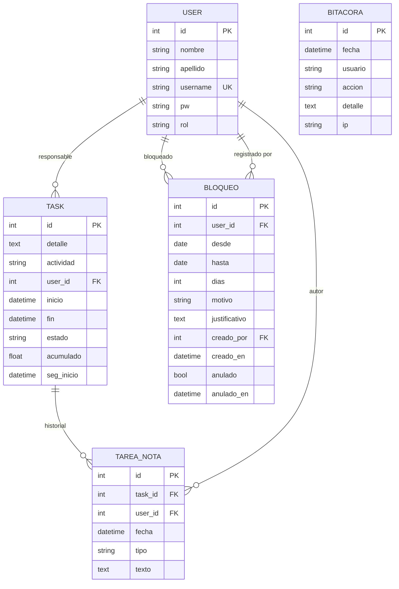

# Documentación técnica — Control de horas

## 1. Arquitectura

Aplicación monolítica Flask (`app.py`) con plantillas Jinja (`templates/`) y una hoja de estilos
(`static/style.css`). Persistencia con SQLAlchemy sobre PostgreSQL (producción) o SQLite (desarrollo).
No usa JavaScript ni recursos externos.

## 2. Roles y permisos

| Ruta | Auditor | Admin |
|---|---|---|
| `/login`, `/logout` | Sí | Sí |
| `/` (formulario + lista de tareas) | Solo sus tareas | Todas |
| `POST /tarea` (crear) | Solo a su nombre | A nombre de cualquier usuario |
| `POST /tarea/<id>/<acción>` | Solo sus tareas | Todas |
| `/usuarios` (crear/listar) | No (403) | Sí |
| `/dashboard` | No (403) | Sí |
| `/bitacora` | No (403) | Sí (solo lectura) |

Los usuarios solo pueden ser creados por un Admin; no existe registro público. El control se aplica en el
servidor (decorador `login_required`), no en la interfaz.

## 3. Modelo de datos

- **User:** `id, nombre, apellido, username (único), pw (hash), rol (Admin|Auditor)`
- **Task:** `id, detalle, actividad, user_id, inicio, fin, estado, acumulado (horas), seg_inicio`
- **Bitacora:** `id, fecha, usuario, accion, detalle, ip`
- **TareaNota:** `id, task_id (FK), user_id (FK), fecha, tipo (CIERRE|REINICIO|EDICION), texto`
- **Bloqueo:** `id, user_id (FK), desde, hasta, dias, motivo, justificativo, creado_por (FK), creado_en, anulado, anulado_en`

`seg_inicio` es el inicio del tramo activo; `acumulado` suma los tramos ya cerrados.

## 4. Reglas de negocio

1. Horario laboral: 08:00–17:00 en la zona `APP_TZ`. Solo esas horas se cuentan (`horas()`).
2. **Iniciado** solo puede establecerse dentro del horario laboral; inicia el conteo del tramo.
3. **Suspendido** y **Culminado** cierran el tramo: suman al acumulado las horas del tramo dentro del
   horario. Culminado además fija la hora de fin.
4. Si inicio y fin caen en días distintos, se suma la franja laboral de cada día; lo transcurrido fuera de
   horario no cuenta y el conteo continúa a las 08:00 del día siguiente. La columna "Días" muestra los días
   calendario abarcados.
5. Una tarea Culminada no puede cambiar de estado; solo puede editarse su detalle. Una tarea Por Iniciar no puede suspenderse ni culminarse por
   botón.
6. Al registrar una tarea ya Culminada con inicio y fin manuales, las horas se calculan con la misma
   función. Fines de semana y feriados **no** se excluyen.
7. Las horas de un tramo en curso (Iniciado) se contabilizan al suspender o culminar; el dashboard muestra
   solo horas ya acumuladas.

## 5. Controles de auditoría

- **Bitácora append-only:** ninguna ruta actualiza ni elimina registros de `Bitacora`. Eventos: `LOGIN_OK`,
  `LOGIN_FALLIDO`, `LOGOUT`, `USUARIO_CREADO`, `TAREA_CREADA`, `TAREA_INICIADO`, `TAREA_SUSPENDIDO`,
  `TAREA_CULMINADO`, `TAREA_RECHAZADA`. Cada evento guarda fecha, usuario, detalle e IP.
- El evento se escribe en la **misma transacción** que el cambio (excepto login/logout, que tienen su propio
  commit).
- Las claves se almacenan con hash de Werkzeug (scrypt por defecto en la versión 3.x) y nunca se registran en bitácora.
- Protección CSRF con token de sesión en todos los POST; cookies `HttpOnly`, `SameSite=Lax` y `Secure` en
  producción; IP real mediante `ProxyFix` tras el proxy de Render.
- Autorización siempre en servidor; un Auditor que fuerce una URL o acción ajena recibe 403.

## 6. Limitaciones conocidas y recomendaciones

- La bitácora es inmutable **por diseño de la aplicación**, no de la base de datos. Para garantía fuerte,
  use un rol de BD con `INSERT/SELECT` sobre `bitacora` (sin `UPDATE/DELETE`) y respaldos periódicos.
- Las ediciones de tareas se registran por acción de estado, no por campo. No hay edición ni borrado de
  tareas o usuarios.
- No hay bloqueo por intentos fallidos de login (los intentos quedan en bitácora), doble factor, expiración por inactividad, cambio o restablecimiento de clave, ni baja definitiva de usuarios (existe bloqueo temporal); se recomienda añadirlos.
- No hay exclusión de fines de semana ni feriados.
- La zona horaria es única para toda la organización (`APP_TZ`).
- Sin pruebas automatizadas incluidas.

## 7. Mantenimiento

- Dependencias en `requirements.txt`; revise y actualice periódicamente.
- Cambios de esquema: SQLAlchemy `create_all()` solo crea tablas nuevas; para modificar columnas
  existentes use una herramienta de migraciones (p. ej. Flask-Migrate).
- Rotar `SECRET_KEY` cierra todas las sesiones activas.

## 8. Alojamiento

| Elemento | Detalle |
|---|---|
| URL | https://control-horas-4dbq.onrender.com/login |
| Proveedor | Render (servicio web `control-horas` + PostgreSQL `control-horas-db`) |
| Servidor de aplicación | gunicorn (`gunicorn app:app`) |
| Código fuente | GitHub, rama `main`; cada push redespliega automáticamente |
| Infraestructura | `render.yaml` (Blueprint) |
| Zona horaria | `APP_TZ` (America/Caracas) |
| Región y plan contratado | Completar según el panel de Render |

Notas del plan gratuito de Render (render.com/docs/free): el servicio web se suspende tras 15 minutos sin
tráfico, el sistema de archivos es efímero y la base Postgres gratuita expira a los 30 días (14 días de gracia
antes de eliminarse con sus datos). Para datos de auditoría use planes de pago con respaldos.

## 9. Pasos de despliegue

1. Verificar que el repositorio no incluya `instance/` ni archivos `.db` (`.gitignore`).
2. Definir el plan del servicio web en `render.yaml` (`plan: free` o `starter`).
3. Render → **New → Blueprint** → seleccionar el repositorio → indicar `ADMIN_PASSWORD` → **Apply**.
4. Revisar **Logs** hasta ver `Booting worker`; abrir la URL e ingresar como `admin`.
5. Crear un Admin nominal y los usuarios Auditor desde **Usuarios**.
6. Verificar `/bitacora` y el horario laboral (`APP_TZ`).
7. Cambios posteriores: `git push` a `main`.

Incidencias resueltas en el primer despliegue: las plantillas deben estar en `templates/` y el CSS en
`static/`; la URL de Postgres se fuerza a `postgresql+psycopg2://` para usar el driver instalado
(`psycopg2-binary`).

## 10. Parámetros de seguridad

| Parámetro | Valor |
|---|---|
| Hash de claves | Werkzeug `generate_password_hash` (scrypt por defecto en 3.x) |
| Longitud mínima de clave | 8 caracteres |
| Cookies de sesión | `HttpOnly`, `SameSite=Lax`, `Secure` cuando existe `DATABASE_URL` |
| CSRF | Token de sesión aleatorio (16 bytes) en todos los POST; renovado al iniciar sesión |
| Transporte | HTTPS provisto por Render; `ProxyFix` (1 proxy) para IP y esquema reales |
| Acceso a datos | ORM SQLAlchemy con consultas parametrizadas |
| Plantillas | Escape automático de Jinja |
| Secretos | Variables de entorno (`SECRET_KEY` generada por Render); nunca en el repositorio |
| Respuestas de error | 400 (CSRF inválido), 403 (rol no permitido), 404 (recurso inexistente) |

Los controles pendientes y su priorización están en el informe técnico (`Informe_Sistema_Control_de_Horas.docx`).

## 11. Ajustes de la versión 1.1

| Ajuste | Comportamiento |
|---|---|
| Bloqueo de usuarios | El Admin bloquea una cuenta de 1 a 365 días desde una fecha, con motivo (Vacaciones, Permiso, Licencia, Otro) y justificativo obligatorios. Impide el ingreso y cierra sesiones abiertas. Se puede anular antes de tiempo. Historial en `/usuarios`. |
| Culminar una tarea | Pantalla de confirmación con fecha y hora de fin (no futura ni anterior al inicio) y observación obligatoria. En el registro manual se exige casilla de confirmación y observación. |
| Mismo día | Si inicio y fin son del mismo día solo se muestran horas; la columna "Días" se muestra únicamente cuando abarca varios días. |
| Reinicio en otro día | Una tarea suspendida que se reanuda en un día distinto al de inicio exige justificación y nueva fecha y hora de inicio (8:00–17:00, no futura ni anterior al inicio). Las horas nuevas se suman a las acumuladas. |
| Edición | Auditor (sus tareas) y Admin (todas) editan solo el detalle desde la tabla principal; antes y después quedan en `tarea_nota`. |

Nuevos eventos de bitácora: `LOGIN_BLOQUEADO`, `USUARIO_BLOQUEADO`, `USUARIO_DESBLOQUEADO`, `TAREA_REINICIADA`,
`TAREA_EDITADA`. `TAREA_CREADA` ahora incluye inicio y fin.

Despliegue: `db.create_all()` crea las tablas nuevas (`tarea_nota`, `bloqueo`) al arrancar; no modifica columnas
de tablas existentes (esta versión no las cambia).

## 12. Esquema de la base de datos y arquitectura

`bitacora.usuario` guarda el nombre de usuario como texto (sin clave foránea) para conservar la evidencia.
La aplicación no elimina registros: no existen rutas de borrado.
